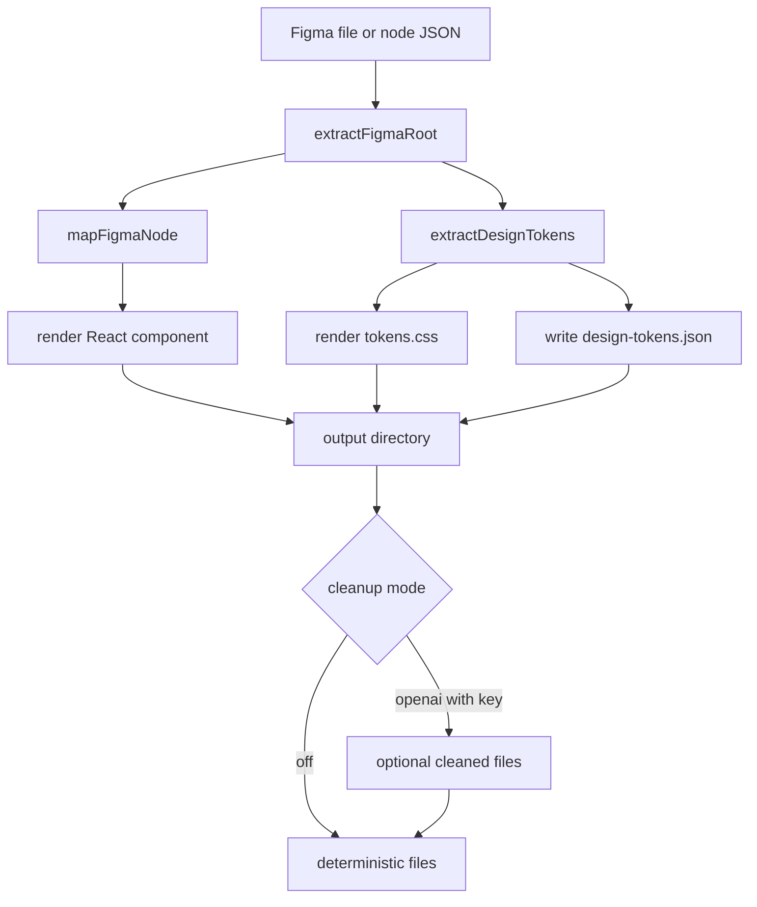

# figma-react-forge

Convert Figma REST API JSON, Figma node API JSON, or exported node JSON into a small React component package: JSX, component CSS, CSS custom-property tokens, and a `design-tokens.json` file.

`figma-react-forge` is for frontend engineers, design-system teams, prototypers, and product teams that need a deterministic starting point from real Figma structure without turning a design file into an opaque runtime dependency.

## Use Cases

- Turn a Figma frame into a React proof of concept that can be reviewed in a real app.
- Extract color, radius, spacing, and typography tokens while keeping links back to source node IDs.
- Bootstrap design-system component work from current design files, then refactor by hand.
- Generate frontend fixtures for visual prototyping, implementation spikes, and design QA.
- Fetch a file or specific node directly from Figma when local JSON exports are not convenient.

## How It Works

The converter accepts three input shapes:

- Full Figma REST file responses with a top-level `document`.
- Figma node API responses with a top-level `nodes` object.
- A direct exported node object with `id`, `name`, and `type`.

It finds the render root, ignores hidden nodes, maps Figma node types into renderable containers, text nodes, and shapes, extracts reusable tokens, then writes deterministic files. Optional OpenAI cleanup can polish generated files, but deterministic rendering is the default and fallback path.



## Output

For a component named `InvoiceCard`, the CLI writes:

- `InvoiceCard.tsx`
- `InvoiceCard.css`
- `tokens.css`
- `design-tokens.json`
- `index.ts`

Token extraction currently covers:

- Solid fill colors as `--frf-color-*`
- Corner radii as `--frf-radius-*`
- Auto-layout gap and padding values as `--frf-spacing-*`
- Text style values as `--frf-type-*`

Renderer output currently covers:

- React function components with source `data-figma-id` attributes.
- Text nodes rendered as `<span>`.
- Shape and leaf nodes rendered as `<div aria-hidden="true" />`.
- Container nodes rendered as nested `<div>` elements.
- Width, minimum height, flex direction, gap, padding, background, color, radius, and typography declarations where those values exist in the Figma JSON.

## Setup

Requirements:

- Node.js `20.19+`, `22.13+`, or `24+`
- npm

Install and build:

```bash
npm install
npm run build
```

For repeatable CI-style installs:

```bash
npm ci
```

## Environment

Copy `.env.example` to `.env.local` for local use. Keep real secrets out of Git.

```bash
FIGMA_ACCESS_TOKEN=
OPENAI_API_KEY=
OPENAI_MODEL=
```

`FIGMA_ACCESS_TOKEN` is only needed when using `--file-key`. Use a token with the narrowest available Figma file-read scope for your account and revoke it if it is exposed or no longer needed.

`OPENAI_API_KEY` is optional and only used when `--cleanup openai` is selected. Leave it unset for fully deterministic local generation.

## CLI Usage

Convert a local JSON export:

```bash
npm run build
node dist/cli.js --input ./figma-node.json --out ./generated --component InvoiceCard
```

Fetch a file from Figma:

```bash
FIGMA_ACCESS_TOKEN=your_token_here node dist/cli.js --file-key abc123 --out ./generated
```

Fetch a specific node from Figma:

```bash
FIGMA_ACCESS_TOKEN=your_token_here node dist/cli.js --file-key abc123 --node-id 1:2 --out ./generated
```

Run optional OpenAI cleanup:

```bash
OPENAI_API_KEY=your_key_here node dist/cli.js --input ./figma-node.json --out ./generated --cleanup openai
```

## Library Usage

```ts
import { convertFigmaJson } from "figma-react-forge";

const files = await convertFigmaJson(figmaJson, {
  componentName: "InvoiceCard"
});
```

Fetch JSON yourself if you need custom auth, caching, rate-limit handling, or file access policy. Pass the parsed JSON into `convertFigmaJson`.

## Commands

```bash
npm run audit
npm run outdated
npm run lint
npm run typecheck
npm test
npm run build
npm run public-surface
```

`npm run audit` fails on moderate-or-higher vulnerabilities. `npm run outdated` reports packages where the installed version is behind the registry. CI runs both before lint, typecheck, tests, build, and the public-surface check.

## Codebase Structure

```text
src/
  cli.ts              CLI parsing, env loading, input selection, file writing
  converter.ts        High-level convertFigmaJson pipeline
  figma-api.ts        Figma REST URL construction and token-authenticated fetch
  input.ts            Figma file, node API, and direct node root extraction
  mapper.ts           Figma node to render tree mapping
  naming.ts           Component, class, token, and value formatting helpers
  openai-cleanup.ts   Optional cleanup path with deterministic fallback
  render.ts           React, CSS, token CSS, and index rendering
  tokens.ts           Design token extraction and CSS variable rendering
  types.ts            Public and internal TypeScript types
tests/                Vitest coverage for mapping, tokens, rendering, CLI, API, and cleanup
scripts/              Repo checks for public surface and secret hygiene
.github/workflows/   CI checks
.github/dependabot.yml
```

## Privacy and Security

- Do not commit `.env`, `.env.local`, Figma tokens, OpenAI keys, generated private design exports, or local workflow notes.
- Treat Figma JSON as design IP. Review generated output before publishing if the source file contains private product names, customer data, unreleased UI, or comments embedded in node names.
- Prefer node-specific fetches with `--node-id` when you do not need the full file.
- Rotate Figma personal access tokens regularly and revoke them immediately after suspected exposure.
- Optional OpenAI cleanup sends generated files to the configured OpenAI API. Keep `--cleanup off` for local-only deterministic generation.
- `npm run public-surface` checks that private workflow files, env files, common API-key patterns, and attribution markers are not tracked.
