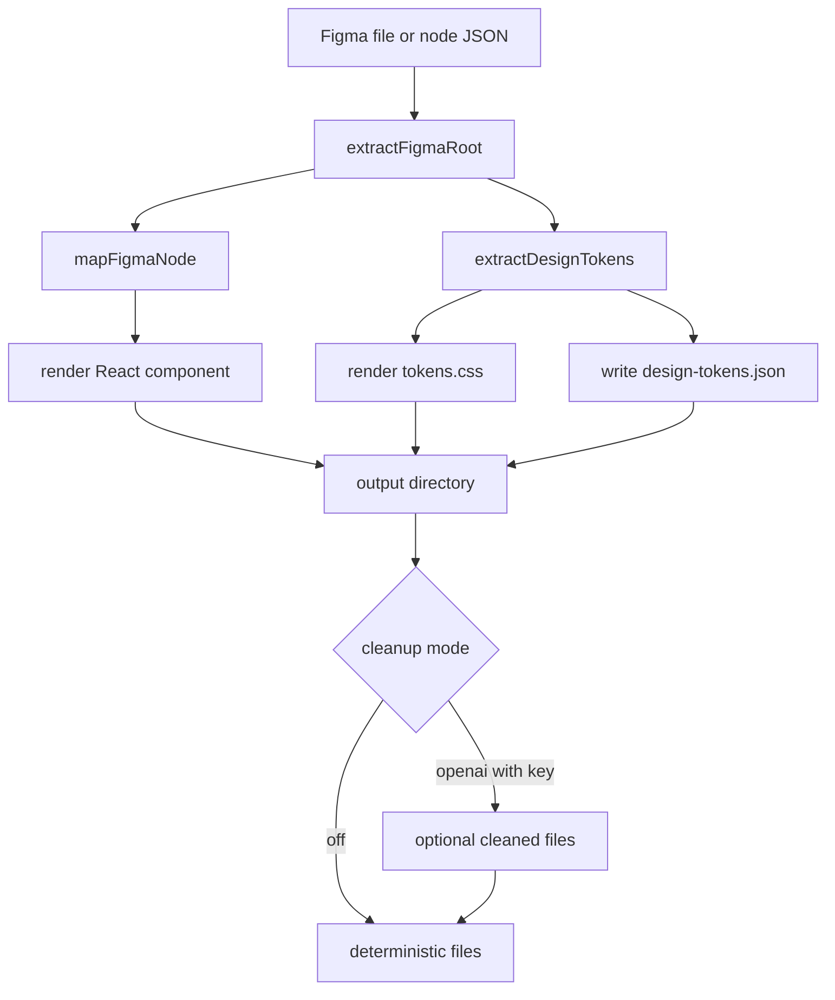

# Architecture

## Input shapes

The converter accepts three input shapes:

- Full Figma REST file responses with a top-level `document`.
- Figma node API responses with a top-level `nodes` object.
- A direct exported node object with `id`, `name` and `type`.

## Pipeline

It finds the render root, ignores hidden nodes, maps Figma node types into renderable containers, text nodes and shapes, extracts reusable tokens, then writes deterministic files. Optional OpenAI cleanup can polish the written files, but deterministic rendering is the default and the fallback path.

The diagram source is [architecture.mmd](architecture.mmd).

## Module map

| Path | Role |
| --- | --- |
| `src/cli.ts` | CLI parsing, env loading, input selection, file writing |
| `src/converter.ts` | High-level `convertFigmaJson` pipeline |
| `src/figma-api.ts` | Figma REST URL construction and token-authenticated fetch |
| `src/input.ts` | Figma file, node API and direct node root extraction |
| `src/mapper.ts` | Figma node to render tree mapping |
| `src/naming.ts` | Component, class, token and value formatting helpers |
| `src/openai-cleanup.ts` | Optional cleanup path with deterministic fallback |
| `src/render.ts` | React, CSS, token CSS and index rendering |
| `src/tokens.ts` | Design token extraction and CSS variable rendering |
| `src/types.ts` | Public and internal TypeScript types |
| `tests/` | Vitest coverage for mapping, tokens, rendering, CLI, API and cleanup |
| `scripts/` | Repo checks for public surface and secret hygiene |
| `.github/workflows/` | CI checks |
| `.github/dependabot.yml` | Dependabot configuration |
